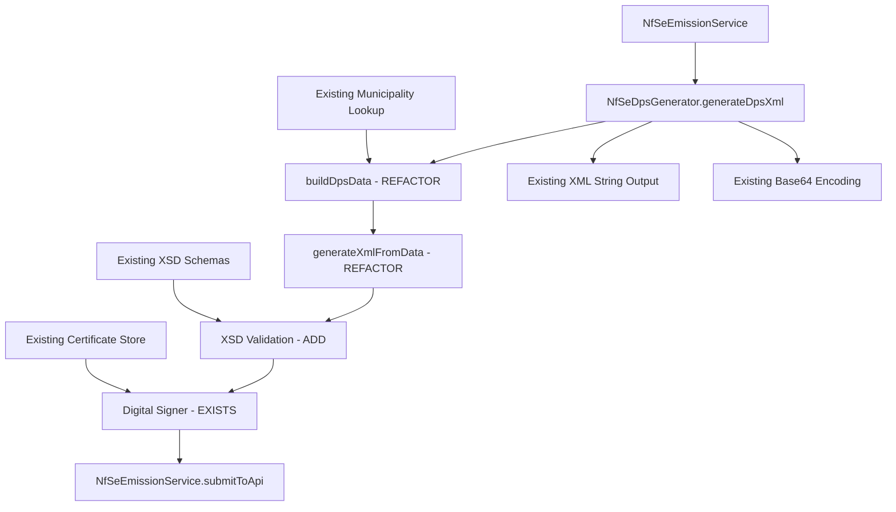

# Design Document

## Overview

This design document outlines the comprehensive correction of the NFSe DPS (Declaração de Prestação de Serviços) XML generation system to comply with the official `DPS_v1.00.xsd` schema. The current implementation generates XML with an incorrect namespace and structure that fails XSD validation. This design addresses the complete transformation of the XML generation process, digital signature implementation, and automated validation system.

## Architecture

### Refactoring Approach

**IMPORTANT**: This design focuses on **refactoring existing functions** in the current codebase rather than creating new components. The goal is to update the existing `NfSeDpsGenerator.php` methods to generate XSD-compliant XML while maintaining the current architecture and avoiding code duplication.

**Current Architecture Issues in Existing Code:**
- `generateXmlFromData()` uses incorrect namespace and schema reference
- `addIdentificacaoDps()` creates wrong structure with unnecessary wrapper elements
- Element naming and casing doesn't match XSD requirements
- `addPrestador()` and `addTomador()` use generic inscription fields instead of direct document identification
- `buildServiceDescription()` doesn't sanitize HTML tags
- Phone number handling includes formatting characters

**Target Architecture (Refactoring Existing Methods):**
- Update `generateXmlFromData()` to use correct namespace as specified in XSD
- Refactor `addIdentificacaoDps()` to add fields directly to main information element without wrapper
- Modify `addPrestador()` and `addTomador()` to use direct document identification structure per XSD
- Enhance `buildServiceDescription()` with HTML sanitization
- Update phone number processing to digits-only format
- Integrate XSD validation into existing generation pipeline

**Existing Service Integration:**
- `NfSeEmissionService.php` remains the main orchestrator for the emission process
- `NfSeEmissionService.php` calls `NfSeDpsGenerator->generateDpsXml()` and handles API submission
- No changes needed to the emission workflow, only to the XML generation logic

### Existing System Components (To Be Refactored)



**Key Existing Methods to Refactor:**
- `NfSeDpsGenerator->generateXmlFromData()` - Update XML structure
- `NfSeDpsGenerator->addIdentificacaoDps()` - Remove wrapper, add direct fields
- `NfSeDpsGenerator->addPrestador()` - Change to `<emit>` structure
- `NfSeDpsGenerator->addTomador()` - Change to `<toma>` structure  
- `NfSeDpsGenerator->addServico()` - Update service and values structure
- `NfSeDpsGenerator->buildServiceDescription()` - Add HTML sanitization

## Refactoring Existing Components

### 1. Data Sanitization (Add to Existing Methods)

**Enhance Existing Methods in `NfSeDpsGenerator`:**
- `buildServiceDescription()` - Add HTML tag removal using `strip_tags()`
- `buildPrestadorData()` and `buildTomadorData()` - Add phone sanitization (digits only)
- Add private helper methods for data cleaning without creating new interfaces

**New Private Helper Methods to Add:**
```php
private function sanitizePhone(string $phone): string;
private function sanitizeServiceDescription(string $description): string;
private function formatDateTimeISO8601(string $datetime): string;
```

### 2. XSD-Compliant XML Generation (Refactor Existing Methods)

**Refactor Existing Methods in `NfSeDpsGenerator`:**

**`generateXmlFromData()` Changes:**
- Update namespace to match XSD specification
- Add version attribute as required by XSD
- Update element naming and casing to match XSD requirements

**`addIdentificacaoDps()` → Rename to `addInfDpsFields()`:**
- Remove wrapper elements not required by XSD
- Add identification fields directly to main information element as per XSD structure

**`addPrestador()` → Rename to `addEmitElement()`:**
- Change structure to use direct document identification as specified in XSD
- Update address structure to match XSD national address requirements
- Add tax regime information group as required by XSD

**`addTomador()` → Rename to `addTomaElement()`:**
- Change structure to use direct document identification as specified in XSD
- Update address structure to match XSD requirements

**`addServico()` → Refactor to `addServElement()` and `addValoresElement()`:**
- Split service and values into separate elements as per XSD structure
- Remove wrapper elements not required by XSD, add individual value fields
- Add tax group structure when applicable as specified in XSD
- Ensure service description fields contain plain text only

### 3. XSD Validation Integration (Use Existing `NfSeXsdValidator`)

**Enhance Existing `NfSeXsdValidator` Class:**
- The `validateDpsXml()` method already exists and works with `DPS_v1.00.xsd`
- Integrate validation call into `NfSeDpsGenerator->generateDpsXml()` before returning XML
- Add validation demonstration to existing `html-admin-manual-emission.php`

**Integration Points:**
1. **In `generateDpsXml()`**: Add validation step after XML generation
2. **In Manual Emission Interface**: Display validation results
3. **In `generateXsdValidationReport()`**: Already exists, enhance with new structure

### 4. Digital Signature (Use Existing System)

**Existing Digital Signature Components:**
- Digital signature system already exists and works
- `NfSeEmissionService` already handles signature process
- Signature target needs to be updated from current element to `<infDPS>`

**Required Changes to Existing Signature:**
- **Target Element**: Update to sign the main information element as specified in XSD
- **Reference URI**: Update to use the correct Id attribute reference format
- **Signature Placement**: Ensure signature is placed correctly within root element as per XSD structure

**No Interface Changes Needed**: Existing signature system will work with updated XML structure

## Data Models

### DPS Data Structure (XSD-Compliant)

The data structure will be determined by analyzing the XSD schema during implementation. Key structural requirements:

**Main Document Structure:**
- Root element with proper namespace and version
- Main information element with unique identifier
- Digital signature placement as per XSD requirements

**Entity Identification:**
- Direct document identification (CNPJ/CPF) instead of generic inscription types
- Complete entity information including names and addresses
- Contact information with proper formatting

**Address Structure:**
- National address format with all required fields
- Municipality information with proper codes and names
- Postal codes and geographic identifiers

**Service Information:**
- Plain text service descriptions without HTML
- Service location and classification data
- Tax applicability indicators

**Financial Values:**
- Service values with proper decimal formatting
- Discount and deduction amounts
- Tax calculations with appropriate precision
- Tax group structures when applicable

**Temporal Information:**
- Emission dates in ISO8601 format
- Competence periods in required date format
- Environment and emission type indicators

## Error Handling

### Validation Error Categories

1. **Schema Errors**: XSD validation failures
2. **Structure Errors**: Missing required elements or attributes
3. **Data Format Errors**: Invalid field formats or lengths
4. **Business Logic Errors**: Tax calculation inconsistencies
5. **Signature Errors**: Digital signature creation or validation failures

### Error Response Format

```php
class ValidationResult
{
    public bool $valid;
    public array $errors;
    public array $warnings;
    public array $info;
    
    public function addError(string $code, string $message, ?string $xpath = null): void;
    public function addWarning(string $code, string $message, ?string $xpath = null): void;
    public function hasErrors(): bool;
    public function getErrorSummary(): string;
}
```

## Testing Strategy

### Unit Tests

1. **Data Sanitization Tests**
   - Phone number cleaning (remove formatting)
   - HTML tag removal from descriptions
   - Email validation
   - Document number formatting

2. **XML Generation Tests**
   - Namespace correctness
   - Element structure validation
   - Attribute presence and format
   - Field mapping accuracy

3. **XSD Validation Tests**
   - Valid XML passes validation
   - Invalid XML fails with specific errors
   - Edge cases and boundary conditions

### Integration Tests

1. **End-to-End Generation**
   - Order → DPS XML → XSD Validation → Digital Signature
   - Multiple order types (individual, company, different services)
   - Different environments (production, homologation)

2. **API Compatibility Tests**
   - Generated XML accepted by Produção Restrita
   - Base64 encoding/decoding integrity
   - JSON embedding without escaping issues

## Implementation Phases (Refactoring Approach)

### Phase 1: Core XML Structure Refactoring
- Refactor `generateXmlFromData()` method with correct namespace and versioning
- Update `addIdentificacaoDps()` to add fields directly to `<infDPS>` without wrapper
- Ensure `<infDPS>` uses lowercase and proper Id attribute

### Phase 2: Entity Structure Correction  
- Refactor `addPrestador()` to `addEmitElement()` with `<CNPJ>/<CPF>` structure
- Refactor `addTomador()` to `addTomaElement()` with proper entity identification
- Update address handling to use `<enderNac>` with required `<xMun>` field

### Phase 3: Service and Values Restructuring
- Refactor `addServico()` to separate service and values elements
- Remove `<vTotTrib>` wrapper and implement individual value fields
- Add ISS group structure when applicable
- Enhance `buildServiceDescription()` with HTML sanitization

### Phase 4: Data Sanitization Integration
- Add phone number sanitization (digits only) to existing contact methods
- Implement HTML tag removal in service descriptions
- Add date/time formatting to ISO8601 standard

### Phase 5: Validation and Testing Integration
- Integrate existing `NfSeXsdValidator` into generation pipeline
- Add validation demonstration to `html-admin-manual-emission.php`
- Update existing test methods to work with new structure
- Ensure `NfSeEmissionService` continues to work without changes

## Security Considerations

1. **Certificate Management**
   - Secure storage of private keys
   - Certificate validation and expiration checks
   - Support for different certificate formats

2. **Data Sanitization**
   - XSS prevention in service descriptions
   - SQL injection prevention in data handling
   - Input validation and filtering

3. **XML Security**
   - XXE (XML External Entity) attack prevention
   - XML bomb protection
   - Secure XML parsing configuration

## Monitoring and Logging

1. **Generation Metrics**
   - Success/failure rates
   - Generation time tracking
   - XSD validation results

2. **Error Tracking**
   - Detailed error logging with context
   - Validation failure categorization
   - Performance bottleneck identification

3. **Audit Trail**
   - DPS generation history
   - Signature creation logs
   - API submission tracking