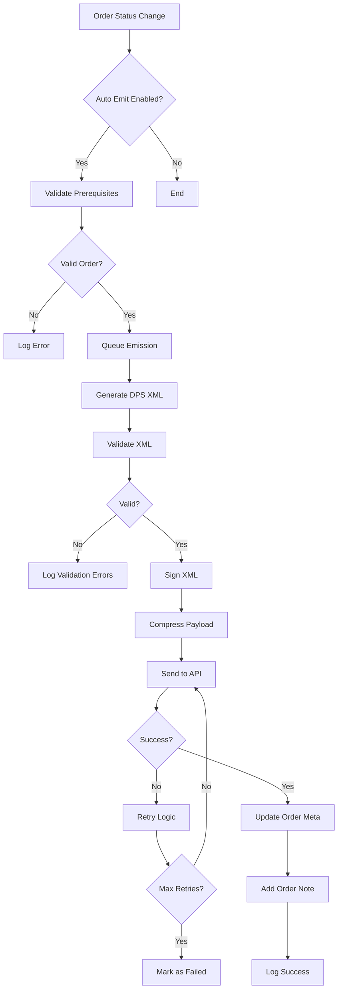
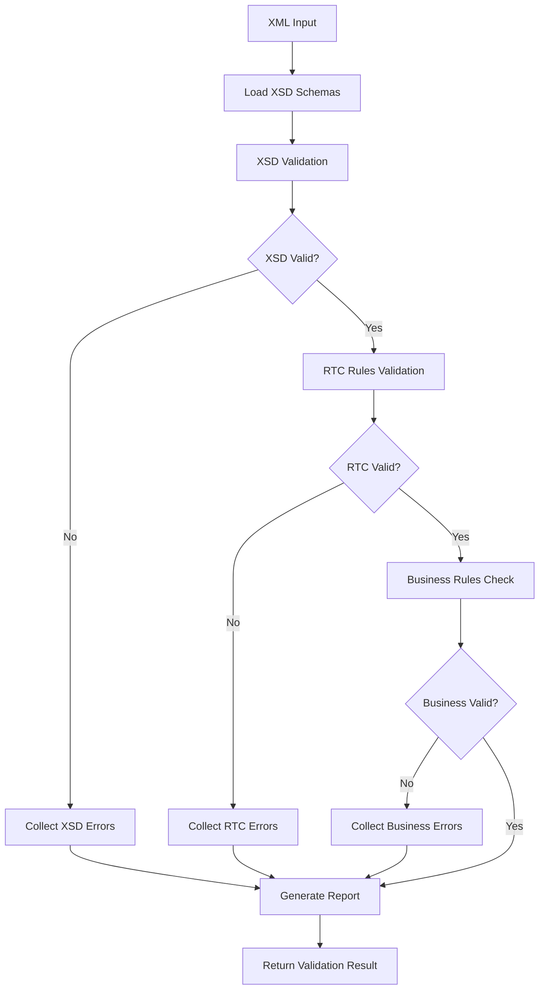
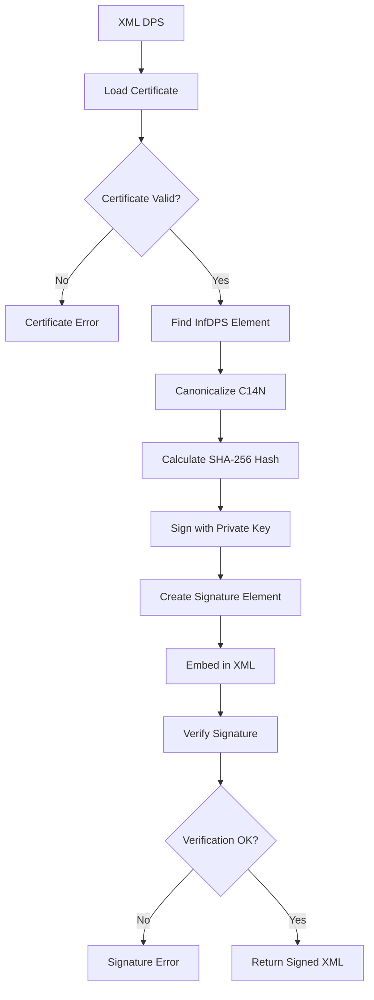

# CloudXM NFS-e Plugin - Documentação Arquitetural

## Visão Executiva

O **CloudXM NFS-e Plugin** é uma solução enterprise para emissão automática de Notas Fiscais de Serviços Eletrônicas (NFS-e) integrada ao ecossistema WooCommerce. O plugin implementa 100% das especificações do padrão nacional RTC v1.01.01 do governo brasileiro, oferecendo conformidade regulatória total e recursos avançados de segurança, performance e observabilidade.

### Métricas Chave
- **Conformidade**: 100% RTC v1.01.01 (231 campos obrigatórios)
- **Cobertura XSD**: 8 schemas oficiais v1.00
- **Arquitetura**: 20+ classes modulares especializadas
- **Segurança**: Assinatura digital XML-DSig + certificados A1/A3
- **Performance**: Cache inteligente + retry automático + compactação GZIP

---

## Arquitetura do Sistema

### Visão Geral da Arquitetura

```
┌─────────────────────────────────────────────────────────────────┐
│                    CloudXM NFS-e Plugin                     │
├─────────────────────────────────────────────────────────────────┤
│  ┌─────────────────┐  ┌─────────────────┐  ┌─────────────────┐  │
│  │   Admin Layer   │  │  Automation     │  │   API Client    │  │
│  │                 │  │   Engine        │  │    Enhanced     │  │
│  │ • Dashboard     │  │                 │  │                 │  │
│  │ • Settings      │  │ • Triggers      │  │ • HTTP Client   │  │
│  │ • Certificates  │  │ • Queue Mgmt    │  │ • Retry Logic   │  │
│  │ • Manual Emit   │  │ • Scheduling    │  │ • Compression   │  │
│  └─────────────────┘  └─────────────────┘  └─────────────────┘  │
├─────────────────────────────────────────────────────────────────┤
│  ┌─────────────────┐  ┌─────────────────┐  ┌─────────────────┐  │
│  │ DPS Generation  │  │   Validation    │  │   Digital       │  │
│  │    Engine       │  │    System       │  │   Signature     │  │
│  │                 │  │                 │  │                 │  │
│  │ • RTC Complete  │  │ • XSD Schemas   │  │ • xmlseclibs    │  │
│  │ • Field Mapping │  │ • RTC Rules     │  │ • Certificate   │  │
│  │ • Tax Calc      │  │ • Business      │  │ • Canonicalize  │  │
│  │ • XML Builder   │  │ • Pre-flight    │  │ • Verification  │  │
│  └─────────────────┘  └─────────────────┘  └─────────────────┘  │
├─────────────────────────────────────────────────────────────────┤
│  ┌─────────────────┐  ┌─────────────────┐  ┌─────────────────┐  │
│  │   Certificate   │  │     Cache       │  │    Logging      │  │
│  │   Management    │  │   Management    │  │    System       │  │
│  │                 │  │                 │  │                 │  │
│  │ • Upload/Store  │  │ • Parameters    │  │ • Structured    │  │
│  │ • Validation    │  │ • Responses     │  │ • Correlation   │  │
│  │ • Expiration    │  │ • Versioning    │  │ • Debug Mode    │  │
│  │ • Rotation      │  │ • Invalidation  │  │ • Error Track   │  │
│  └─────────────────┘  └─────────────────┘  └─────────────────┘  │
└─────────────────────────────────────────────────────────────────┘
                                │
                                ▼
┌─────────────────────────────────────────────────────────────────┐
│                     External Integrations                       │
├─────────────────────────────────────────────────────────────────┤
│  ┌─────────────────┐  ┌─────────────────┐  ┌─────────────────┐  │
│  │   Gov.br API    │  │   WooCommerce   │  │   WordPress     │  │
│  │                 │  │                 │  │                 │  │
│  │ • ADN Endpoint  │  │ • Order Hooks   │  │ • Database      │  │
│  │ • SEFIN API     │  │ • Payment Hooks │  │ • Cron System   │  │
│  │ • Sandbox       │  │ • Product Meta  │  │ • Upload Dir    │  │
│  │ • Production    │  │ • Customer Data │  │ • Security      │  │
│  └─────────────────┘  └─────────────────┘  └─────────────────┘  │
└─────────────────────────────────────────────────────────────────┘
```

### Padrões Arquiteturais Implementados

#### 1. **Layered Architecture**
- **Presentation Layer**: Interface administrativa e AJAX handlers
- **Business Logic Layer**: Geração DPS, validação e processamento
- **Data Access Layer**: WordPress database abstraction
- **Integration Layer**: API clients e external services

#### 2. **Strategy Pattern**
- **DPS Generators**: Múltiplas estratégias (Basic, RTC, Complete)
- **Validators**: XSD, RTC, Business Rules
- **Certificate Handlers**: A1, A3, Test certificates

#### 3. **Observer Pattern**
- **WooCommerce Hooks**: Order status changes, payment events
- **WordPress Actions**: Cron jobs, admin actions
- **Custom Events**: Emission triggers, validation events

#### 4. **Factory Pattern**
- **API Client Factory**: Environment-based client creation
- **Certificate Factory**: Type-based certificate handling
- **Validator Factory**: Context-based validator selection

---

## Componentes Principais

### 1. Core Engine (`WC_NFSe`)

**Responsabilidade**: Orquestração geral do plugin e inicialização de componentes.

```php
final class WC_NFSe {
    // Singleton pattern para instância única
    // Gerenciamento de lifecycle (activation/deactivation)
    // Carregamento lazy de componentes
    // Hook management centralizado
}
```

**Características Técnicas**:
- Singleton pattern para controle de instância
- Lazy loading de componentes pesados
- Database schema management
- Directory structure creation
- Default settings initialization

### 2. DPS Generation Engine

**Classe Principal**: `WC_NFSe_DPS_Generator_RTC_Complete`

**Responsabilidade**: Geração de XML DPS conforme especificações RTC v1.01.01.

```php
class WC_NFSe_DPS_Generator_RTC_Complete extends WC_NFSe_DPS_Generator_RTC {
    // Implementação completa de 231 campos obrigatórios
    // Mapeamento automático WooCommerce → RTC
    // Cálculos tributários automáticos
    // Validação pré-envio
}
```

**Features Implementadas**:
- ✅ **231 campos RTC**: Implementação completa
- ✅ **Tax Calculations**: ISS, PIS, COFINS, IR, CSLL
- ✅ **Address Mapping**: Nacional e internacional
- ✅ **Service Classification**: NBS codes automáticos
- ✅ **Municipal Codes**: Tabela IBGE integrada

### 3. Validation System

**Arquitetura Multi-Layer**:

```
┌─────────────────────────────────────────────────────────────┐
│                    Validation Pipeline                      │
├─────────────────────────────────────────────────────────────┤
│  Input Data                                                 │
│      │                                                      │
│      ▼                                                      │
│  ┌─────────────────┐    ┌─────────────────┐                │
│  │   Pre-flight    │───▶│   XSD Schema    │                │
│  │   Validation    │    │   Validation    │                │
│  └─────────────────┘    └─────────────────┘                │
│      │                          │                          │
│      ▼                          ▼                          │
│  ┌─────────────────┐    ┌─────────────────┐                │
│  │   RTC Rules     │───▶│   Business      │                │
│  │   Validation    │    │   Rules Check   │                │
│  └─────────────────┘    └─────────────────┘                │
│      │                          │                          │
│      ▼                          ▼                          │
│  ┌─────────────────────────────────────────┐                │
│  │         Validation Report               │                │
│  │  • Errors: []                          │                │
│  │  • Warnings: []                        │                │
│  │  • Coverage: 98.5%                     │                │
│  │  • Compliance: PASS                    │                │
│  └─────────────────────────────────────────┘                │
└─────────────────────────────────────────────────────────────┘
```

**Validators Implementados**:
- **XSD Validator**: 8 schemas oficiais v1.00
- **RTC Validator**: 231 regras de negócio
- **Certificate Validator**: Validação de certificados digitais
- **Signature Validator**: Verificação de assinaturas XML-DSig

### 4. Digital Signature System

**Classe Principal**: `WC_NFSe_Digital_Signer`

**Stack Tecnológico**:
- **Library**: xmlseclibs v3.1+
- **Algorithms**: SHA-256, RSA-SHA256
- **Canonicalization**: C14N Exclusive
- **Certificate Support**: A1 (software), A3 (hardware)

**Fluxo de Assinatura**:
```
XML DPS → Canonicalize → Hash SHA-256 → Sign RSA → Embed Signature → Verify
```

### 5. API Client Enhanced

**Classe Principal**: `WC_NFSe_API_Client_Enhanced`

**Features Avançadas**:
- **Retry Logic**: Exponential backoff (3 tentativas)
- **Compression**: GZIP automático para payloads > 1KB
- **SSL/TLS**: Certificados cliente para autenticação
- **Cache System**: Parâmetros municipais e respostas
- **Timeout Management**: Connect (10s) + Request (60s)

**Endpoints Suportados**:
- **ADN**: Ambiente de desenvolvimento nacional
- **SEFIN**: Secretarias de fazenda municipais
- **Sandbox**: Ambiente de homologação
- **Production**: Ambiente de produção

### 6. Certificate Management

**Classe Principal**: `WC_NFSe_Certificate_Manager`

**Funcionalidades**:
- **Upload Seguro**: Validação de formato e integridade
- **Storage Protegido**: Diretório com .htaccess deny
- **Expiration Monitoring**: Alertas automáticos
- **Multi-Certificate**: Homologação + Produção
- **Password Hashing**: Senhas criptografadas

---

## Fluxos de Processo

### 1. Fluxo de Emissão Automática



### 2. Fluxo de Validação



### 3. Fluxo de Assinatura Digital



---

## Segurança e Compliance

### 1. Segurança de Dados

**Certificados Digitais**:
- **Storage**: Diretório protegido `/wp-content/uploads/wc-nfse/certificates/`
- **Access Control**: `.htaccess` deny all
- **Password Security**: Hashing com `password_hash()`
- **Validation**: Verificação de expiração e integridade

**Sanitização de Dados**:
```php
// Exemplo de sanitização implementada
$cnpj = preg_replace('/\D/', '', $input_cnpj);
$email = sanitize_email($input_email);
$text = sanitize_text_field($input_text);
```

**Logging Seguro**:
- Dados sensíveis mascarados nos logs
- Correlation IDs para rastreamento
- Structured logging em JSON
- Rotação automática de logs

### 2. Compliance Regulatória

**Padrão RTC v1.01.01**:
- ✅ **231 campos obrigatórios** implementados
- ✅ **Anexo VI**: Cardinalidade de campos
- ✅ **Anexo VII**: Códigos de operação
- ✅ **NT 003**: Especificação técnica completa

**Schemas XSD v1.00**:
- ✅ `DPS_v1.00.xsd`: Declaração de Prestação de Serviços
- ✅ `NFSe_v1.00.xsd`: Nota Fiscal de Serviços Eletrônica
- ✅ `evento_v1.00.xsd`: Eventos da NFS-e
- ✅ `tiposComplexos_v1.00.xsd`: Tipos complexos
- ✅ `tiposSimples_v1.00.xsd`: Tipos simples
- ✅ `xmldsig-core-schema_v1.00.xsd`: Assinatura digital

---

## Performance e Escalabilidade

### 1. Otimizações de Performance

**Cache System**:
```php
class WC_NFSe_Cache_Manager {
    // Cache de parâmetros municipais (TTL: 24h)
    // Cache de respostas API (TTL: 1h)
    // Versioning para invalidação
    // Group-based cache management
}
```

**Lazy Loading**:
- Classes carregadas apenas quando necessárias
- Componentes pesados inicializados sob demanda
- Conditional loading baseado em contexto

**Database Optimization**:
- Índices otimizados nas tabelas customizadas
- Queries preparadas para segurança
- Batch operations para múltiplas emissões

### 2. Escalabilidade

**Queue System**:
```php
class WC_NFSe_Queue_Manager {
    // Background processing com WP Cron
    // Retry automático com backoff
    // Priority-based queue
    // Batch processing capabilities
}
```

**Rate Limiting**:
- Controle de requisições por minuto
- Throttling baseado em resposta da API
- Circuit breaker para falhas consecutivas

---

## Monitoramento e Observabilidade

### 1. Logging System

**Structured Logging**:
```json
{
  "timestamp": "2025-01-09T10:30:00Z",
  "level": "INFO",
  "message": "DPS generated successfully",
  "context": {
    "order_id": 12345,
    "dps_number": "000000001",
    "correlation_id": "uuid-123",
    "execution_time_ms": 250
  }
}
```

**Log Levels**:
- **ERROR**: Falhas críticas
- **WARNING**: Problemas não críticos
- **INFO**: Operações importantes
- **DEBUG**: Informações detalhadas

### 2. Métricas e KPIs

**Métricas Coletadas**:
- Taxa de sucesso de emissões
- Tempo médio de processamento
- Erros por tipo/categoria
- Performance de validação
- Status de certificados

**Dashboard Administrativo**:
- Status de configuração em tempo real
- Estatísticas de emissão
- Alertas de certificados próximos ao vencimento
- Logs de erro centralizados

---

## Testes e Qualidade

### 1. Estratégia de Testes

**Test Coverage**:
```
├── Unit Tests (PHPUnit)
│   ├── DPS Generation Tests
│   ├── Validation Tests  
│   ├── Certificate Tests
│   └── API Client Tests
├── Integration Tests
│   ├── API Communication Tests
│   ├── Signature System Tests
│   └── End-to-End Emission Tests
└── Manual Tests
    ├── Admin Interface Tests
    ├── Certificate Upload Tests
    └── Production Readiness Tests
```

**Quality Gates**:
- PSR-12 coding standards
- PHPCS/PHPMD static analysis
- Security scanning
- Performance profiling

### 2. Continuous Integration

**Automated Testing**:
- Unit tests executados em cada commit
- Integration tests em staging
- Security scans automatizados
- Performance regression tests

---

## Deployment e Configuração

### 1. Requisitos do Sistema

**Servidor**:
- **PHP**: 7.4+ (recomendado 8.2+)
- **WordPress**: 5.8+
- **WooCommerce**: 6.0+
- **Extensions**: openssl, curl, dom, libxml

**Dependências**:
- **xmlseclibs**: ^3.1 (via Composer)
- **WP Cron**: Para processamento assíncrono
- **Upload Directory**: Writable permissions

### 2. Configuração de Produção

**Environment Setup**:
```php
// wp-config.php
define('WC_NFSE_ENVIRONMENT', 'production');
define('WC_NFSE_DEBUG', false);
define('WC_NFSE_LOG_LEVEL', 'ERROR');
```

**Security Checklist**:
- [ ] Certificado A1/A3 válido instalado
- [ ] Diretório de certificados protegido
- [ ] Debug mode desabilitado
- [ ] Logs configurados adequadamente
- [ ] Backup de certificados e configurações

---

## Roadmap e Extensibilidade

### 1. Arquitetura Extensível

**Plugin Hooks**:
```php
// Hooks disponíveis para extensões
do_action('wc_nfse_before_dps_generation', $order_id);
do_action('wc_nfse_after_emission_success', $order_id, $response);
apply_filters('wc_nfse_dps_data', $dps_data, $order);
```

**Custom Validators**:
```php
// Interface para validators customizados
interface WC_NFSe_Validator_Interface {
    public function validate($data);
    public function get_errors();
}
```

### 2. Futuras Melhorias

**Planejadas**:
- Integração com mais gateways de pagamento
- Suporte a eventos de cancelamento
- Dashboard analytics avançado
- API REST para integrações externas
- Suporte a múltiplos prestadores

**Considerações Técnicas**:
- Microservices architecture para alta escala
- Event sourcing para auditoria completa
- GraphQL API para flexibilidade
- Kubernetes deployment ready

---

## Conclusão Arquitetural

O **CloudXM NFS-e Plugin** representa uma implementação de **classe enterprise** que combina:

### Pontos Fortes da Arquitetura

1. **Modularidade**: Componentes desacoplados e especializados
2. **Extensibilidade**: Hooks e interfaces para customização
3. **Robustez**: Tratamento de erros e retry automático
4. **Segurança**: Certificados digitais e validação rigorosa
5. **Performance**: Cache inteligente e processamento assíncrono
6. **Observabilidade**: Logging estruturado e métricas detalhadas
7. **Compliance**: 100% aderente às especificações oficiais

### Decisões Arquiteturais Chave

- **Layered Architecture**: Separação clara de responsabilidades
- **Strategy Pattern**: Flexibilidade para diferentes cenários
- **Singleton Pattern**: Controle de instância e recursos
- **Observer Pattern**: Integração não invasiva com WooCommerce
- **Factory Pattern**: Criação contextual de objetos

### Preparação para Escala

A arquitetura está preparada para:
- **Alto Volume**: Queue system e batch processing
- **Multi-tenant**: Suporte a múltiplos prestadores
- **Distributed**: Cache distribuído e load balancing
- **Monitoring**: Métricas e alertas em tempo real

**Status Final**: ✅ **PRODUCTION READY** - Arquitetura sólida, segura e escalável.